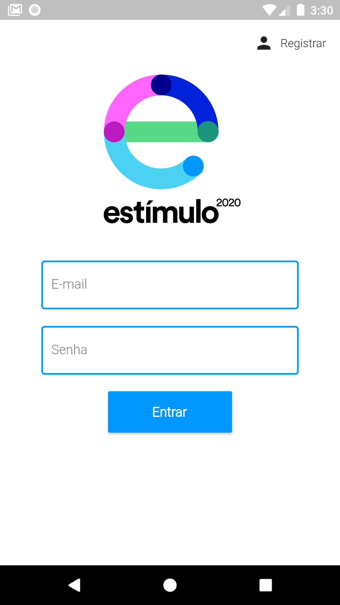
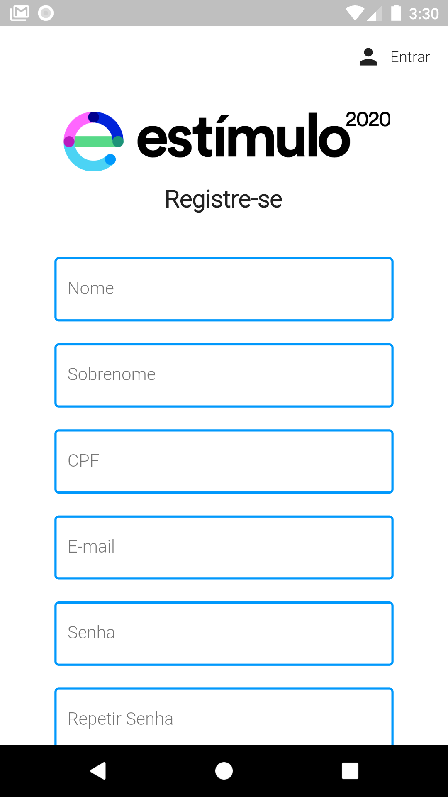
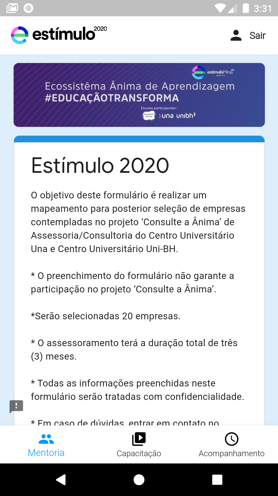
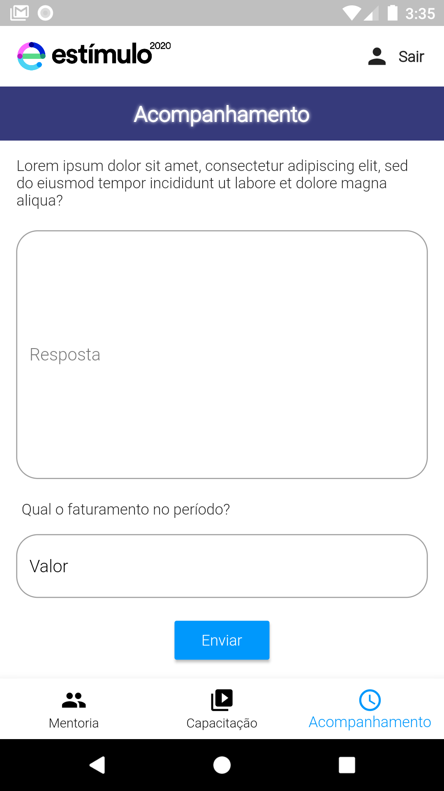

<h1 align="center">Projeto Estímulo 2020</h1>
<h1 align="center">

</h1>

 <a href="#-sobre-o-projeto">Sobre</a> •
 <a href="#-tecnologias">Tecnologias</a> •
 <a href="#-layout">Layout</a> •  
 <a href="#-como-contribuir-para-o-projeto">Contribuir</a> •
 <a href="#-licença">Licença</a> •    

## 💻 Sobre o projeto
O presente projeto tem por escopo desenvolver uma [aplicação mobile](https://sites.google.com/prof.unibh.br/consulteaanima/inicio/aplicativo) funcional para atender as necessidade do projeto [Estímulo 2020](https://www.estimulo2020.org/).

O estímulo é um movimento sem fins lucrativos que conta com donos de grandes negócios apoiando donos de pequenos negócios, através de suporte financeiro e capacitação profissional.

Projeto desenvolvido durante a execução da unidade currícular de Usabilidade, Desenvolvimento web, mobile e jogos oferecida pela faculdade [UNA](https://www.una.br/).

### 🛠 Tecnologias

As seguintes ferramentas foram usadas na construção do projeto:

- [Flutter](https://flutter.dev/)
- [Dart](https://dart.dev/)
- [Material](https://material.io/)
- [Firebase](https://firebase.google.com/)
- [Firebase Authentication](https://firebase.google.com/docs/auth)
- [Cloud Firestore](https://firebase.google.com/docs/firestore)
- [Cloud Functions for Firebase](https://firebase.google.com/products/functions?hl=pt-br)
- [Node.js](https://nodejs.org/en/)
- [Nodemailer](https://nodemailer.com/about/)

## 🎨 Layout

### Login/Credenciamento

  
&nbsp;&nbsp;
  

### Trilhas

  
&nbsp;&nbsp;
  
&nbsp;&nbsp;
  

## 💪 Como contribuir para o projeto

1. Faça um **fork** do projeto.
2. Crie uma nova branch com as suas alterações: `git checkout -b my-feature`
3. Salve as alterações e crie uma mensagem de commit contando o que você fez: `git commit -m "feature: My new feature"`
4. Envie as suas alterações: `git push origin my-feature`
> Caso tenha alguma dúvida confira este [guia de como contribuir no GitHub](./CONTRIBUTING.md)

<h2 id=autor>:grin: Autor</h2>

Desenvolvido por 
<a href="https://www.linkedin.com/in/rafael-ferreira-pedrosa-021b16ba/" target="_blank">Rafael Ferreira Pedrosa</a>.

## 📝 Licença

Este projeto esta sobe a licença [MIT](./LICENSE).
